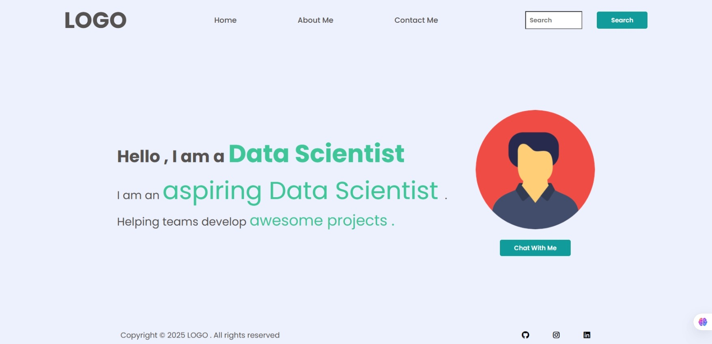
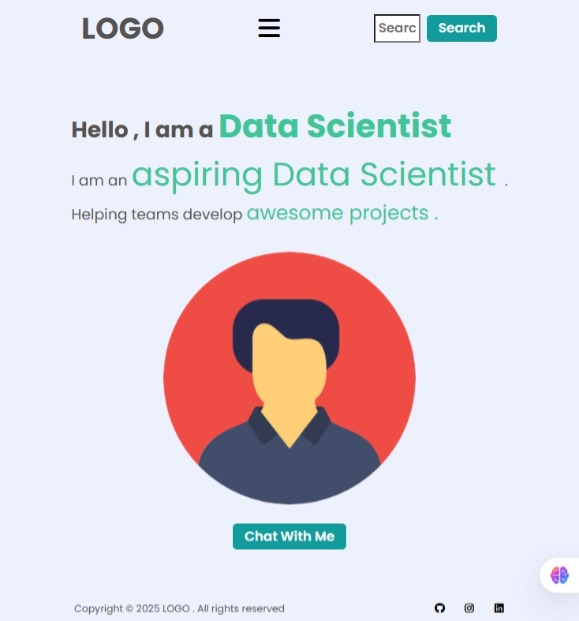

# 🚀 Frontend Mock Ups - 1
A short practicing project made while learning.


---

## 📌 Table of Contents
- [🚀 Frontend Mock Ups - 1](#-frontend-mock-ups---1)
  - [📌 Table of Contents](#-table-of-contents)
  - [📖 About](#-about)
    - [✨ Features](#-features)
  - [⚙️ Installation](#️-installation)
  - [🖼 Screenshots](#-screenshots)
  - [🤝 Contributing](#-contributing)
  - [📜 License](#-license)
  - [📬 Contact](#-contact)


## 📖 About
A simple begineer friendly practice project for basic HTML,CSS and web basics.
### ✨ Features
- It is simple
- Demonstrates the responsiveness of a webpage


## ⚙️ Installation
```bash
# 1. Clone the repository
git clone https://github.com/rajajainds/Web-Dev-Mock-Ups-1

# 2. Navigate into the project folder
cd Web-Dev-Mock-Ups-1

# 3. Run a server in this directory 
#           or
#   Move to this repo and open the path in browser
```

## 🖼 Screenshots

[Desktop View]



[Mobile View]




## 🤝 Contributing

Contributions are welcome!

Follow these steps to contribute:

1.Fork this repository

2.Create a new branch (git checkout -b feature-branch)

3.Commit your changes (git commit -m 'Add new feature')

4.Push to the branch (git push origin feature-branch)

5.Open a Pull Request


## 📜 License

This project is licensed under the MIT License - see the LICENSE file for details.


## 📬 Contact

Raja Jain – rajajainds@gmail.com

GitHub: @rajajainds

LinkedIn: www.linkedin.com/in/rajajainds
